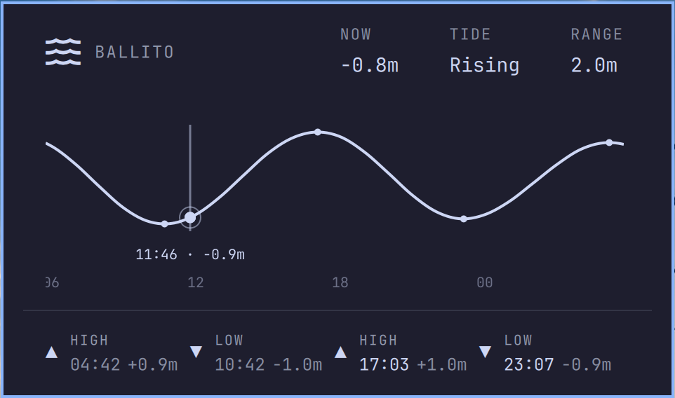

# Tides for Omarchy

A tide widget for the [Omarchy](https://omarchy.org) shell bar, designed to sit
next to the built-in weather widget and follow its look and feel.



A wave icon lives in the bar. Click it for a panel showing:

- **Now / Tide / Range** – current sea level, whether the tide is rising or
  falling, and today's tidal range.
- **A 24-hour tide curve** – six hours back, eighteen ahead, with the current
  time marked. Hover or drag along the curve to read the time and height at any
  point; the cursor snaps gently onto highs, lows and "now".
- **Today's tides** – every high and low for the day, in order, with times and
  heights. Past tides are dimmed; after the day's last tide the row rolls
  forward to tomorrow.

Everything is drawn with the shell's own theme colours and fonts, so it follows
your Omarchy theme.

## Units

Heights can be shown in metres or feet. Use the small `m`/`ft` button in the
bottom-right corner of the tide chart to switch — the choice is stored in
`~/.local/state/omarchy/settings/tides-units.json` and applies to every height
(Now, Range, the curve cursor, and the day's tide rows).

Until you pick a unit, the default follows your system locale: feet on an
`en_US` system, metres everywhere else.

## Install

```bash
omarchy plugin add https://github.com/Woogy7/omarchy-tides.git --enable
```

The widget appears in the centre section of the bar. Move it wherever you like:

```bash
omarchy bar move io.github.woogy7.tides --section right
```

## Location

By default the panel follows the location set in the Omarchy weather widget, so
out of the box the two agree.

To give the tides their own spot – a beach that isn't the town you check the
weather for – click the location name in the panel and search for a place.
Your choice is stored in `~/.local/state/omarchy/settings/tides.json`. Click
the ✕ next to the search field (or commit an empty search) to go back to
following the weather location.

## Remove

```bash
omarchy plugin remove io.github.woogy7.tides
```

To also forget a saved tides location:

```bash
rm -f ~/.local/state/omarchy/settings/tides.json
```

To also reset the units preference:

```bash
rm -f ~/.local/state/omarchy/settings/tides-units.json
```

## Data and dependencies

Tide predictions come from the free
[Open-Meteo Marine API](https://open-meteo.com/en/docs/marine-weather-api)
(`sea_level_height_msl`), and place search uses the
[Open-Meteo Geocoding API](https://open-meteo.com/en/docs/geocoding-api). No
API key or account is needed. Data is fetched with `curl`, which Omarchy
already ships; there are no other dependencies.

Open-Meteo's tide model is a global prediction, good for planning a beach walk
or a surf, but it is not an official tide table – don't use it for navigation.

## Interactions

| Where            | Action                    |
|------------------|---------------------------|
| Bar icon, left   | Open / close the panel    |
| Bar icon, middle | Refresh tide data         |
| Location name    | Click to change location  |
| Tide curve       | Hover / drag to scrub     |
| Esc              | Close the panel           |

## Privacy

The only network requests are to Open-Meteo: the configured coordinates for
tide data, and what you type in the location search for geocoding. Nothing
else leaves your machine.

## Licence

MIT – see [LICENSE](LICENSE).
